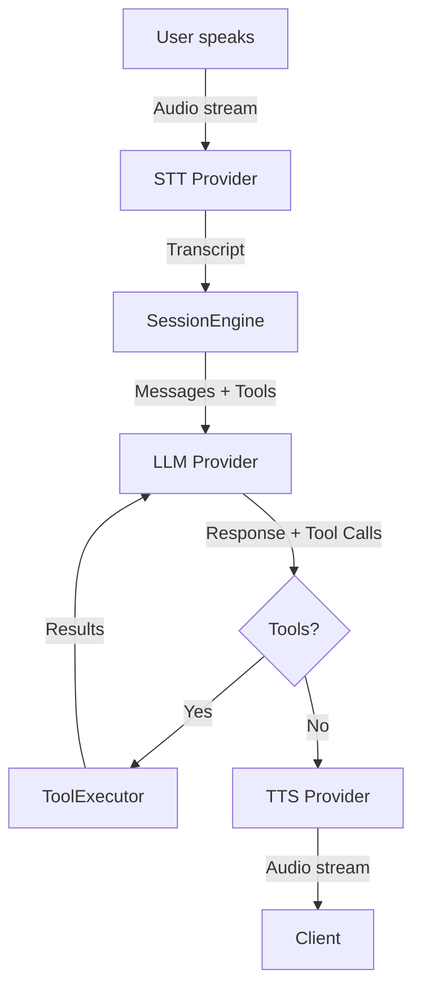

# Vociant Architecture

This document provides a deep dive into Vociant's system design, explaining how the provider abstractions, SessionEngine, and console UI work together to create a vendor-agnostic voice agent platform.

---

## Table of Contents

1. [System Overview](#system-overview)
2. [Core Abstractions](#core-abstractions)
3. [SessionEngine Flow](#sessionengine-flow)
4. [Provider System](#provider-system)
5. [Tool Execution](#tool-execution)
6. [RAG Pipeline](#rag-pipeline)
7. [Console Architecture](#console-architecture)
8. [Data Flow](#data-flow)

---

## System Overview

Vociant is built as a **TypeScript monorepo** using pnpm workspaces:

```
vociant/
├── packages/
│   └── vociant-core/          # Reusable orchestration engine
│       ├── providers/          # TTS/STT/LLM interfaces + adapters
│       ├── engine/             # SessionEngine
│       ├── tools/              # ToolExecutor
│       ├── rag/                # KnowledgeRetriever
│       └── types/              # Shared TypeScript types
└── apps/
    └── vociant-console/        # Next.js control plane
        ├── src/app/            # App Router pages + API routes
        ├── src/components/     # UI components (shadcn)
        ├── prisma/             # Database schema
        └── public/             # Static assets
```

### Design Principles

1. **Provider Agnostic**: Core engine knows nothing about specific vendors
2. **Separation of Concerns**: `vociant-core` is pure TS, reusable in any Node.js environment
3. **Interface-Driven**: All providers implement well-defined interfaces
4. **Event-Driven**: SessionEngine emits events for UI/monitoring

---

## Core Abstractions

### Agent Configuration

An **Agent** encapsulates everything needed to run a voice conversation:

```typescript
interface AgentConfig {
  // Identity
  id: string;
  name: string;

  // Personality
  systemPrompt: string;
  style: 'supportive' | 'concise' | 'detailed' | 'professional';

  // Voice & Audio
  voiceProfile: VoiceProfile;
  ttsProvider: TTSProvider;
  sttProvider: STTProvider;

  // LLM
  llmProvider: LLMProvider;
  llmModel: string;
  llmConfig: { temperature, maxTokens, ... };

  // Conversation Flow
  conversationFlow: {
    silenceTimeoutMs: number;
    interruptionsEnabled: boolean;
    turnEagerness: 'low' | 'medium' | 'high';
  };

  // Extensions
  knowledgeBaseIds: string[];
  toolIds: string[];
}
```

### Voice Profile

Abstracts voice settings across different TTS providers:

```typescript
interface VoiceProfile {
  id: string;
  provider: TTSProvider;
  voiceId: string;            // Provider-specific voice identifier
  language: string;           // e.g., 'en-US'
  settings: {
    stability?: number;       // ElevenLabs: voice consistency
    similarityBoost?: number; // ElevenLabs: voice similarity
    speed?: number;           // Universal: 0.5-2.0
    pitch?: number;           // Some providers support pitch shift
  };
}
```

### Session State

Tracks conversation state across turns:

```typescript
interface SessionState {
  sessionId: string;
  messages: ChatMessage[];      // LLM conversation history
  variables: Record<string, any>; // System tool state
  turnCount: number;
  lastActivityAt: Date;
}
```

---

## SessionEngine Flow

The **SessionEngine** is the heart of Vociant. It orchestrates a single voice conversation:

### Lifecycle



### Turn Processing

1. **Audio Input**
   ```typescript
   async processAudioStream(audioStream: AsyncIterable<AudioChunk>)
   ```
   - Receives audio chunks from WebSocket
   - If agent is speaking + `interruptionsEnabled`, stops TTS
   - Resets silence timer

2. **Speech Recognition**
   ```typescript
   for await (const result of sttProvider.transcribeStream(audioStream)) {
     if (result.partial) emit('transcript.partial', result.partial);
     if (result.final) finalTranscript = result.final;
   }
   ```
   - Streams partial results for UI feedback
   - Waits for final transcript

3. **LLM Processing**
   ```typescript
   const llmResponse = await llmProvider.chat(
     sessionState.messages,
     tools,
     llmConfig
   );
   ```
   - Appends user message to history
   - Calls LLM with conversation context + RAG snippets + tool schemas

4. **Tool Execution** (if LLM returns tool calls)
   ```typescript
   for (const toolCall of llmResponse.toolCalls) {
     const result = await toolExecutor.execute(toolCall, context);
     sessionState.messages.push({
       role: 'tool',
       content: JSON.stringify(result),
       toolCallId: toolCall.id,
     });
   }
   ```
   - Executes tools sequentially
   - Appends results to messages
   - Calls LLM again with tool results

5. **Text-to-Speech**
   ```typescript
   for await (const chunk of ttsProvider.synthesizeStream(text, voice)) {
     emit('audio.chunk', chunk);
   }
   ```
   - Streams audio chunks to client
   - Can be interrupted if `interruptionsEnabled`

### Event System

SessionEngine emits events for monitoring/UI updates:

```typescript
type SessionEvent =
  | { type: 'session.started' }
  | { type: 'transcript.partial'; text: string }
  | { type: 'transcript.final'; text: string }
  | { type: 'agent.thinking'; turnId: string }
  | { type: 'agent.speaking'; text: string; turnId: string }
  | { type: 'audio.chunk'; chunk: AudioChunk }
  | { type: 'tool.executing'; tool: string }
  | { type: 'tool.completed'; tool: string; result: any }
  | { type: 'error'; error: Error };
```

---

## Provider System

### Interface Design

Each provider type has a standard interface:

```typescript
// TTS Provider
interface ITTSProvider {
  readonly name: string;
  initialize(config: TTSProviderConfig): Promise<void>;
  synthesizeStream(text: string, voice: VoiceProfile): AsyncGenerator<AudioChunk>;
  listVoices(): Promise<VoiceInfo[]>;
}

// STT Provider
interface ISTTProvider {
  readonly name: string;
  initialize(config: STTProviderConfig): Promise<void>;
  transcribeStream(audioStream: AsyncIterable<AudioChunk>): AsyncGenerator<TranscriptResult>;
}

// LLM Provider
interface ILLMProvider {
  readonly name: string;
  initialize(config: LLMProviderConfig): Promise<void>;
  chat(messages: ChatMessage[], tools?: ToolDefinition[]): Promise<LLMResponse>;
}
```

### Provider Factory

```typescript
class ProviderFactory {
  static createTTSProvider(type: TTSProvider): ITTSProvider {
    switch (type) {
      case 'elevenlabs': return new ElevenLabsTTSProvider();
      case 'google': return new GoogleTTSProvider();
      case 'openai': return new OpenAITTSProvider();
      case 'mock': return new MockTTSProvider();
    }
  }
  // Similar for STT and LLM
}
```

### Example: ElevenLabs TTS Adapter

```typescript
export class ElevenLabsTTSProvider implements ITTSProvider {
  readonly name = 'elevenlabs';
  private apiKey?: string;

  async initialize(config: TTSProviderConfig) {
    this.apiKey = config.apiKey;
  }

  async *synthesizeStream(text: string, voice: VoiceProfile) {
    const response = await fetch(
      `https://api.elevenlabs.io/v1/text-to-speech/${voice.voiceId}/stream`,
      {
        method: 'POST',
        headers: {
          'xi-api-key': this.apiKey,
          'Content-Type': 'application/json',
        },
        body: JSON.stringify({
          text,
          model_id: 'eleven_turbo_v2',
          voice_settings: {
            stability: voice.settings?.stability ?? 0.5,
            similarity_boost: voice.settings?.similarityBoost ?? 0.75,
          },
        }),
      }
    );

    const reader = response.body!.getReader();
    while (true) {
      const { done, value } = await reader.read();
      if (done) break;
      yield {
        data: Buffer.from(value),
        sampleRate: 44100,
        channels: 1,
        format: 'mp3',
      };
    }
  }
}
```

---

## Tool Execution

### Tool Categories

1. **System Tools**: Modify internal session state
   ```typescript
   // Example: set_variable
   {
     name: 'set_variable',
     category: 'system',
     schema: {
       type: 'function',
       function: {
         name: 'set_variable',
         parameters: {
           type: 'object',
           properties: {
             name: { type: 'string' },
             value: { type: 'any' }
           }
         }
       }
     }
   }
   ```

2. **Server Tools**: Call external APIs
   ```typescript
   {
     name: 'check_order_status',
     category: 'server',
     endpoint: 'https://api.example.com/orders',
     auth: { type: 'bearer', credentials: { token: 'xxx' } },
     schema: { ... }
   }
   ```

3. **Client Tools**: Trigger frontend actions
   ```typescript
   {
     name: 'open_url',
     category: 'client',
     schema: {
       function: {
         name: 'open_url',
         parameters: {
           properties: { url: { type: 'string' } }
         }
       }
     }
   }
   ```

### Execution Flow

```typescript
async execute(toolCall: ToolCall, context: ToolExecutionContext) {
  const tool = this.tools.get(toolCall.function.name);
  const args = JSON.parse(toolCall.function.arguments);

  switch (tool.category) {
    case 'system':
      return this.executeSystemTool(tool, args, context);
    case 'server':
      return this.executeServerTool(tool, args, context);
    case 'client':
      return { type: 'client_action', tool: tool.name, args };
  }
}
```

---

## RAG Pipeline

### Knowledge Retrieval Flow

1. **Indexing**
   ```typescript
   async indexSource(sourceId: string, documents: string[]) {
     const chunks = documents.map(doc => this.chunkDocument(doc));
     // TODO: Generate embeddings via configured provider
     // TODO: Store in vector database
   }
   ```

2. **Retrieval**
   ```typescript
   async retrieve(query: string, sourceIds: string[]) {
     // TODO: Generate query embedding
     // TODO: Vector similarity search
     // Return top-k chunks
   }
   ```

3. **Context Injection**
   ```typescript
   const ragSnippets = await retriever.retrieve(
     userInput,
     agent.knowledgeBaseIds
   );
   const context = retriever.formatContextForLLM(ragSnippets);

   // Prepend to system prompt
   messages[0].content = context + messages[0].content;
   ```

### Vector Database Integration (Roadmap)

Planned integrations:
- **pgvector** (Postgres extension)
- **Pinecone** (managed vector DB)
- **Weaviate** (open-source vector search)

---

## Console Architecture

### Next.js App Structure

```
apps/vociant-console/
├── src/app/
│   ├── page.tsx                    # Landing page
│   ├── dashboard/
│   │   ├── layout.tsx              # Sidebar navigation
│   │   ├── page.tsx                # Overview dashboard
│   │   ├── agents/
│   │   │   ├── page.tsx            # Agents list
│   │   │   └── [slug]/page.tsx     # Agent builder (tabs)
│   │   ├── sessions/page.tsx       # Sessions list
│   │   └── playground/page.tsx     # Live testing console
│   └── api/
│       ├── agents/route.ts         # CRUD for agents
│       ├── sessions/route.ts       # Session management
│       └── voice/[agentId]/route.ts # WebSocket endpoint
├── src/components/
│   └── ui/                         # shadcn components
├── prisma/
│   └── schema.prisma               # Database schema
└── src/lib/
    ├── db.ts                       # Prisma client
    └── utils.ts                    # Utilities
```

### API Routes

| Endpoint | Method | Description |
|----------|--------|-------------|
| `/api/agents` | GET | List all agents |
| `/api/agents` | POST | Create agent |
| `/api/agents/:id` | GET | Get agent details |
| `/api/agents/:id` | PATCH | Update agent |
| `/api/agents/:id` | DELETE | Delete agent |
| `/api/sessions` | GET | List sessions |
| `/api/sessions` | POST | Create session |
| `/api/voice/:agentId` | WebSocket | Live voice chat |

### WebSocket Protocol

```javascript
// Client → Server
{
  type: 'audio',
  data: ArrayBuffer, // PCM audio chunk
  sampleRate: 16000,
  channels: 1
}

// Server → Client
{
  type: 'transcript.partial',
  text: 'Hello, how...'
}
{
  type: 'agent.speaking',
  text: 'Hello! How can I help you today?'
}
{
  type: 'audio.chunk',
  data: ArrayBuffer, // TTS audio
  format: 'mp3'
}
```

---

## Data Flow

### Complete Request Flow (Voice Session)

```
1. Client opens WebSocket → /api/voice/:agentId
2. Console fetches Agent config from Prisma
3. Console creates SessionEngine with:
   - AgentConfig
   - Provider credentials
   - Tool definitions
4. Client streams mic audio → WebSocket
5. SessionEngine:
   a. Passes audio to STTProvider
   b. Gets transcript
   c. Calls LLMProvider with messages + tools
   d. Executes tools if needed
   e. Calls TTSProvider with response
   f. Streams audio back → WebSocket → Client
6. Console logs Turn to database (Prisma)
7. Client plays TTS audio
```

### Database Schema Highlights

- **Agent**: Stores provider config, prompts, flow settings
- **Session**: Tracks conversation instance
- **Turn**: Individual user-agent exchange with latency metrics
- **Tool**: Function definitions
- **KnowledgeSource**: RAG documents
- **AgentKnowledgeBase**: Many-to-many join
- **ProviderCredential**: API keys (TODO: encrypt)

---

## Extensibility

### Adding a New Provider

1. **Implement the interface**
   ```typescript
   export class MySTTProvider implements ISTTProvider {
     readonly name = 'my-stt';
     async *transcribeStream(...) { ... }
   }
   ```

2. **Register in factory**
   ```typescript
   // packages/vociant-core/src/providers/index.ts
   static createSTTProvider(type: STTProvider) {
     case 'my-stt': return new MySTTProvider();
   }
   ```

3. **Update types**
   ```typescript
   // packages/vociant-core/src/types/index.ts
   type STTProvider = 'elevenlabs' | 'deepgram' | 'my-stt';
   ```

4. **Add to console UI**
   ```typescript
   // apps/vociant-console/.../agent-builder.tsx
   <option value="my-stt">My STT Provider</option>
   ```

### Custom Tool Integration

```typescript
// Define tool
const myTool: Tool = {
  id: 'cuid',
  name: 'get_weather',
  category: 'server',
  endpoint: 'https://api.weather.com/v1/current',
  auth: { type: 'api-key', credentials: { apiKey: 'xxx' } },
  schema: {
    type: 'function',
    function: {
      name: 'get_weather',
      description: 'Get current weather for a location',
      parameters: {
        type: 'object',
        properties: {
          location: { type: 'string', description: 'City name' }
        },
        required: ['location']
      }
    }
  }
};

// Register with agent
await db.tool.create({ data: myTool });
await db.agentTool.create({
  data: { agentId: agent.id, toolId: myTool.id }
});
```

---

## Performance Considerations

### Latency Optimization

1. **STT**: Use streaming-first providers (ElevenLabs Scribe, Deepgram)
2. **LLM**: Prefer GPT-4 Turbo or Claude Opus for speed
3. **TTS**: Use low-latency models (ElevenLabs Turbo v2)
4. **Audio Format**: PCM 16kHz mono for minimal processing

### Scaling

- **Horizontal**: Run multiple console instances behind load balancer
- **WebSocket**: Use sticky sessions or Redis pub/sub for multi-node
- **Database**: Migrate from SQLite → Postgres with connection pooling
- **Providers**: Implement client-side caching for voice lists, embeddings

---

## Security

### Current State (Development)
- Provider credentials stored in plaintext (database)
- No authentication on console routes

### Production Recommendations
1. **Encrypt credentials** using AES-256 (e.g., `@47ng/cloak`)
2. **Add authentication** (NextAuth.js with OAuth)
3. **Rate limiting** on API routes
4. **CORS** configuration for WebSocket origins
5. **Audit logs** for tool executions

---

## Next Steps

See [Roadmap](../README.md#-contributing) for planned features.

**Key Enhancements:**
- Advanced RAG with vector databases
- Telephony channel support
- Multi-agent orchestration
- Observability (OpenTelemetry, Sentry)

---

*For API details, see [API.md](./API.md). For provider integration, see [PROVIDERS.md](./PROVIDERS.md).*
